# LabLink Backend API Documentation

Dokumentasi teknis untuk komunikasi antara Frontend dan Backend developer.

---

## Table of Contents
1. [Physical Data Model (ERD)](#1-physical-data-model-erd)
2. [State Machine Diagrams](#2-state-machine-diagrams)
3. [Sequence Diagrams](#3-sequence-diagrams)

---

## 1. Physical Data Model (ERD)

```mermaid
erDiagram
    %% Core Entities
    RESEARCH_ASSISTANT {
        string id PK
        string username UK
        string password
        string full_name
        string email
        string phone
        string role "ADMIN|HEAD_LAB|RESEARCH_COORD|DIVISION_HEAD|TREASURER|SECRETARY|MEMBER"
        string expert_division
        boolean is_password_changed
        timestamp created_at
        timestamp updated_at
    }

    ACADEMIC_PERIOD {
        string id PK
        string code UK
        string name
        date start_date
        date end_date
        boolean is_active
        boolean is_archived
        timestamp created_at
        timestamp updated_at
    }

    MEMBER_PERIOD {
        string member_id PK,FK
        string period_id PK,FK
        string position
        string status "ACTIVE|ALUMNI"
        timestamp graduated_at
        timestamp joined_at
    }

    %% Project Module
    PROJECT {
        string id PK
        string project_code UK
        string name
        text description
        string leader_id FK
        string period_id FK
        string status "NOT_STARTED|IN_PROGRESS|COMPLETED|CANCELLED"
        string approval_status "PENDING|APPROVED|REJECTED"
        string approved_by
        string rejection_reason
        date start_date
        date end_date
        timestamp created_at
        timestamp updated_at
    }

    PROJECT_MEMBER {
        string project_id PK,FK
        string member_id PK,FK
        string role
        timestamp joined_at
    }

    %% Event Module
    EVENT {
        string id PK
        string event_code UK
        string name
        text description
        string pic_id FK
        string period_id FK
        string status "PLANNED|ONGOING|COMPLETED|CANCELLED"
        string approval_status "PENDING|APPROVED|REJECTED"
        string approved_by
        string rejection_reason
        date start_date
        date end_date
        timestamp created_at
        timestamp updated_at
    }

    EVENT_COMMITTEE {
        string event_id PK,FK
        string member_id PK,FK
        string role
        timestamp joined_at
    }

    EVENT_SCHEDULE {
        string id PK
        string event_id FK
        date activity_date
        string title
        text description
        time start_time
        time end_time
        string location
    }

    %% Archive Module
    ARCHIVE {
        string id PK
        string archive_code UK
        string title
        text description
        string archive_type "PUBLIKASI|HKI|PKM|LAPORAN|SERTIFIKAT"
        string source_type "PROJECT|EVENT"
        string department "INTERNAL|EKSTERNAL"
        string project_id FK
        string event_id FK
        string period_id FK
        string publish_location
        string reference_number
        date publish_date
        timestamp created_at
        timestamp updated_at
    }

    %% Administration Module
    LETTER {
        string id PK
        string letter_number UK
        string letter_type "SURAT_PEMINJAMAN|SURAT_TUGAS|SURAT_KETERANGAN"
        string category "INTERNAL|EKSTERNAL"
        string subject
        string recipient
        text content
        string attachment
        string requester_id FK
        string requester_name
        string requester_nim
        string event_id FK
        string period_id FK
        date borrow_date
        date borrow_return_date
        date issue_date
        string status "PENDING|APPROVED|REJECTED|DOWNLOADED"
        string approved_by
        string rejection_reason
        timestamp created_at
        timestamp updated_at
    }

    INCOMING_LETTER {
        string id PK
        string reference_number
        string sender
        string subject
        date received_date
        text notes
        string attachment_path
        timestamp created_at
        timestamp updated_at
    }

    %% Finance Module
    FINANCE_CATEGORY {
        string id PK
        string name UK
        string type "INCOME|EXPENSE|BOTH"
        text description
        boolean is_active
        timestamp created_at
        timestamp updated_at
    }

    DUES_PAYMENT {
        string id PK
        string member_id FK
        string period_id FK
        int payment_month
        int payment_year
        decimal amount
        date paid_at
        string payment_proof_path
        string status "UNPAID|PENDING|VERIFIED|REJECTED"
        string verified_by
        timestamp created_at
        timestamp updated_at
    }

    FINANCE_TRANSACTION {
        string id PK
        string type "INCOME|EXPENSE"
        string category_id FK
        string period_id FK
        string event_id FK
        string project_id FK
        decimal amount
        date transaction_date
        text description
        string receipt_path
        string created_by
        timestamp created_at
        timestamp updated_at
    }

    PROCUREMENT_REQUEST {
        string id PK
        string requester_id FK
        string item_name
        text description
        string reason
        decimal estimated_price
        string priority "LOW|MEDIUM|HIGH|URGENT"
        string purchase_link
        string status "PENDING|APPROVED|REJECTED|PURCHASED"
        string processed_by
        string rejection_reason
        date processed_at
        string transaction_id FK
        timestamp created_at
        timestamp updated_at
    }

    %% Audit Log
    ACTIVITY_LOG {
        string id PK
        string entity_type
        string entity_id
        string entity_name
        string action "CREATE|UPDATE|DELETE"
        text details
        string performed_by
        timestamp created_at
    }

    %% Relationships
    RESEARCH_ASSISTANT ||--o{ MEMBER_PERIOD : "belongs to"
    ACADEMIC_PERIOD ||--o{ MEMBER_PERIOD : "has"
    
    RESEARCH_ASSISTANT ||--o{ PROJECT : "leads"
    ACADEMIC_PERIOD ||--o{ PROJECT : "contains"
    PROJECT ||--o{ PROJECT_MEMBER : "has"
    RESEARCH_ASSISTANT ||--o{ PROJECT_MEMBER : "participates"
    
    RESEARCH_ASSISTANT ||--o{ EVENT : "is PIC of"
    ACADEMIC_PERIOD ||--o{ EVENT : "contains"
    EVENT ||--o{ EVENT_COMMITTEE : "has"
    RESEARCH_ASSISTANT ||--o{ EVENT_COMMITTEE : "participates"
    EVENT ||--o{ EVENT_SCHEDULE : "has"
    
    PROJECT ||--o{ ARCHIVE : "produces"
    EVENT ||--o{ ARCHIVE : "produces"
    ACADEMIC_PERIOD ||--o{ ARCHIVE : "contains"
    
    RESEARCH_ASSISTANT ||--o{ LETTER : "requests"
    EVENT ||--o{ LETTER : "related to"
    ACADEMIC_PERIOD ||--o{ LETTER : "contains"
    
    RESEARCH_ASSISTANT ||--o{ DUES_PAYMENT : "pays"
    ACADEMIC_PERIOD ||--o{ DUES_PAYMENT : "contains"
    
    FINANCE_CATEGORY ||--o{ FINANCE_TRANSACTION : "categorizes"
    ACADEMIC_PERIOD ||--o{ FINANCE_TRANSACTION : "contains"
    EVENT ||--o{ FINANCE_TRANSACTION : "cost center"
    PROJECT ||--o{ FINANCE_TRANSACTION : "cost center"
    
    RESEARCH_ASSISTANT ||--o{ PROCUREMENT_REQUEST : "requests"
    FINANCE_TRANSACTION ||--o| PROCUREMENT_REQUEST : "fulfills"
```

---

## 2. State Machine Diagrams

### 2.1 Project Approval State

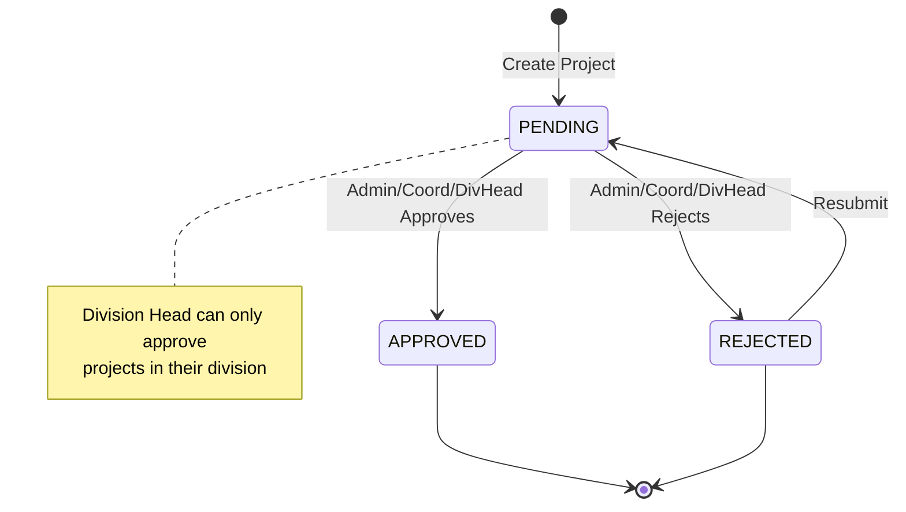

### 2.2 Project Status State

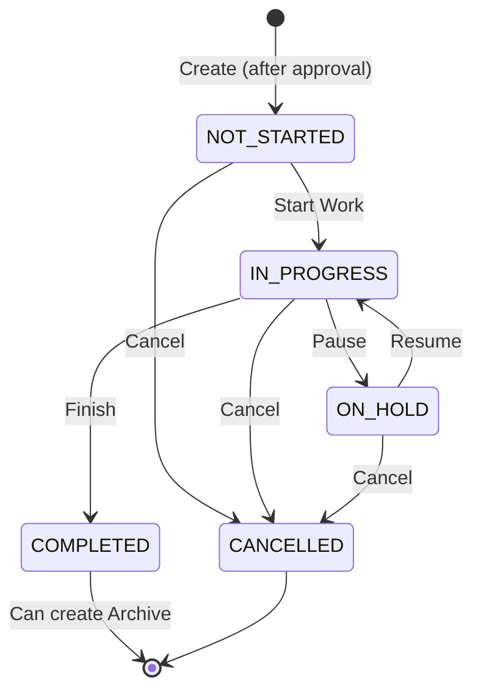

### 2.3 Event Approval State

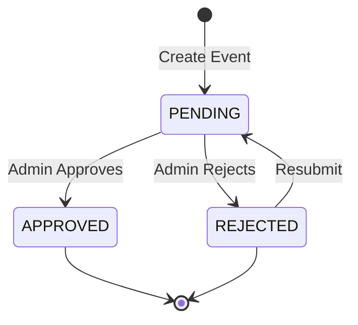

### 2.4 Event Status State

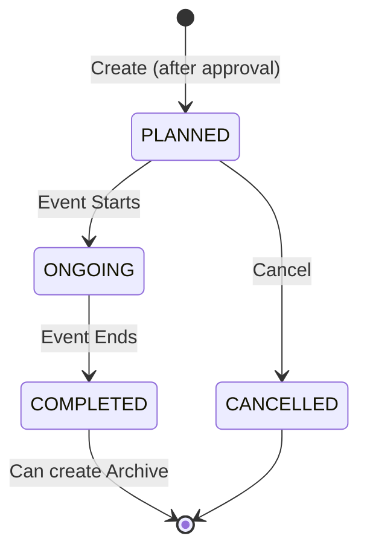

### 2.5 Letter Status State

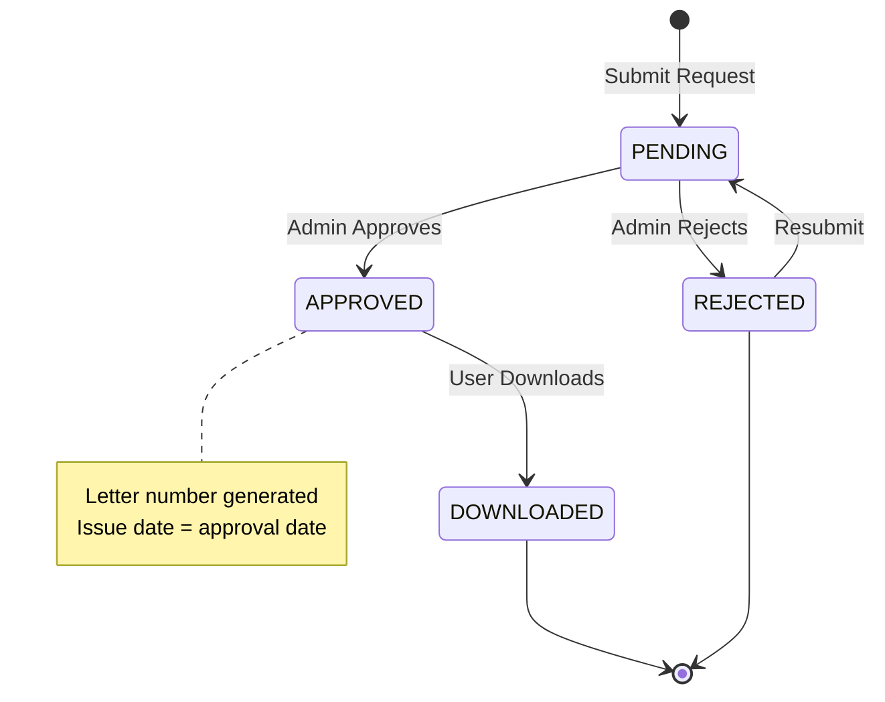

### 2.6 Dues Payment Status State

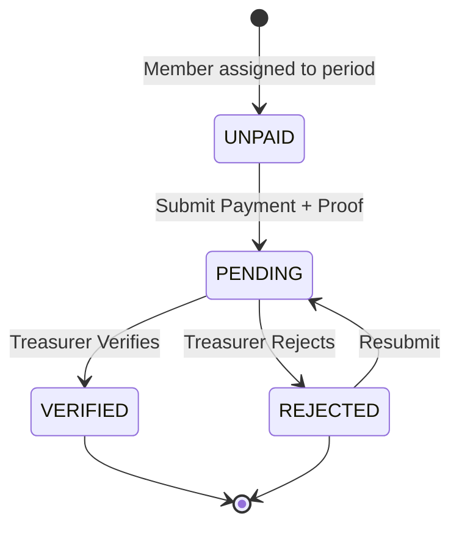

### 2.7 Procurement Request Status State

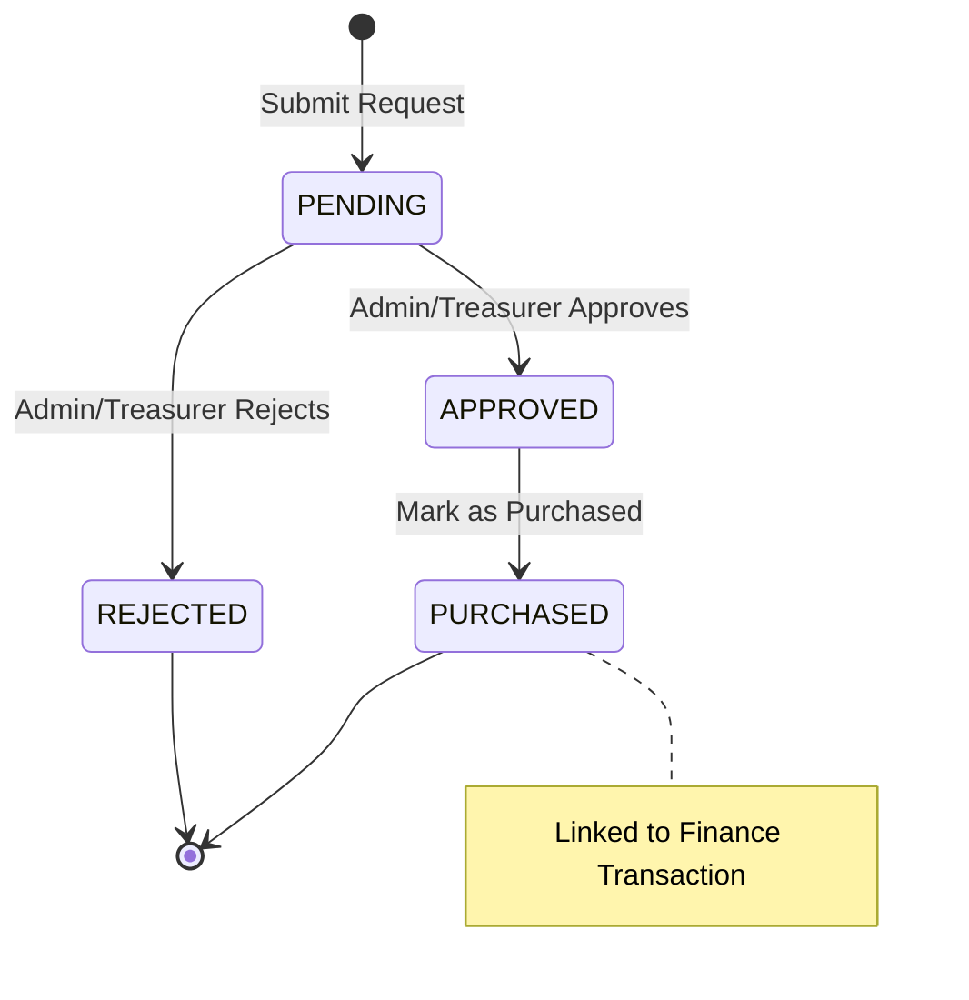

---

## 3. Sequence Diagrams

### 3.1 Authentication Flow

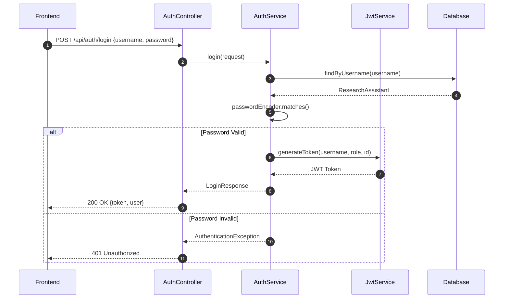

### 3.2 Project Approval Flow

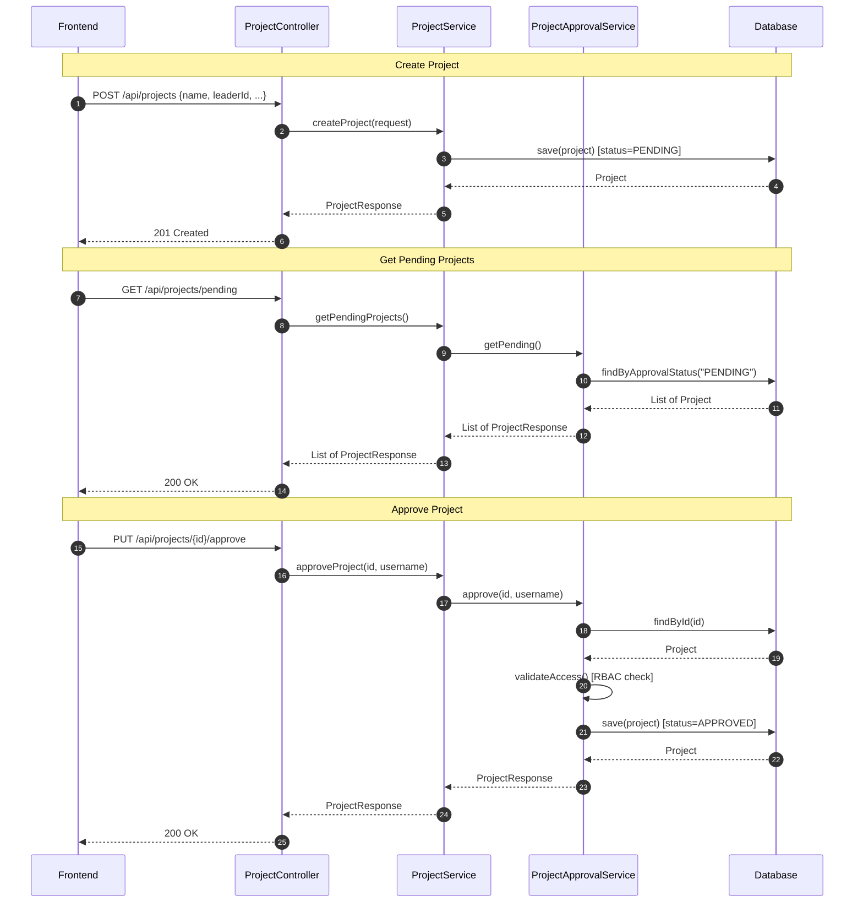

### 3.3 Event with Schedule Flow

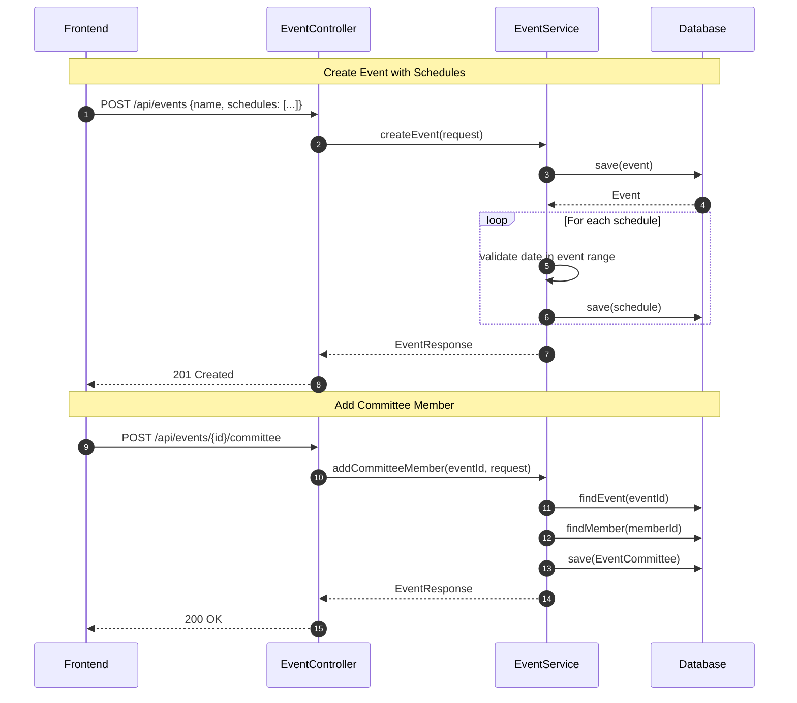

### 3.4 Finance Transaction Flow

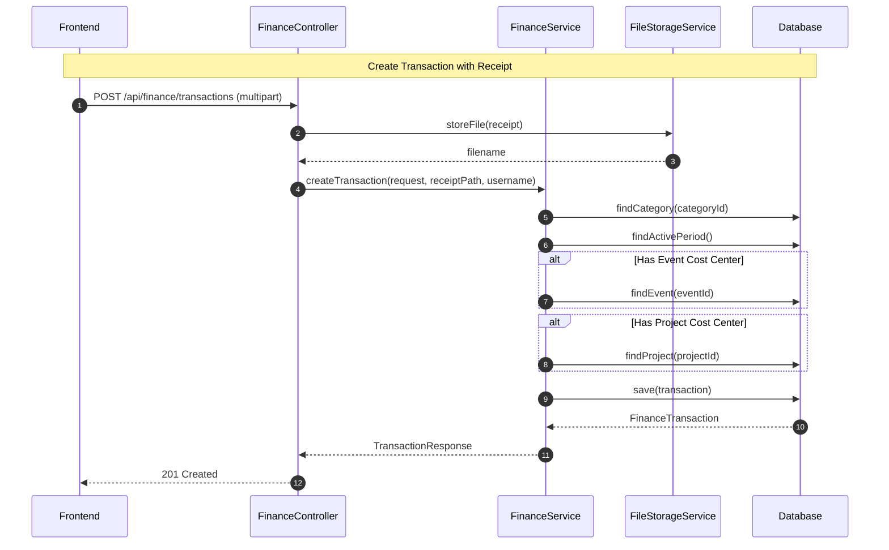

### 3.5 Letter Request & Download Flow

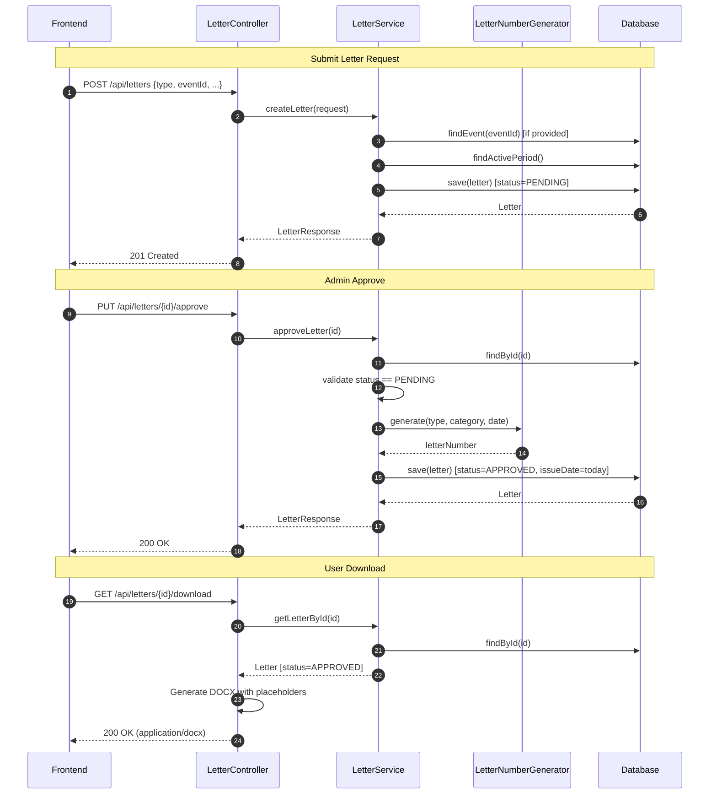

### 3.6 Procurement Approval to Purchase Flow

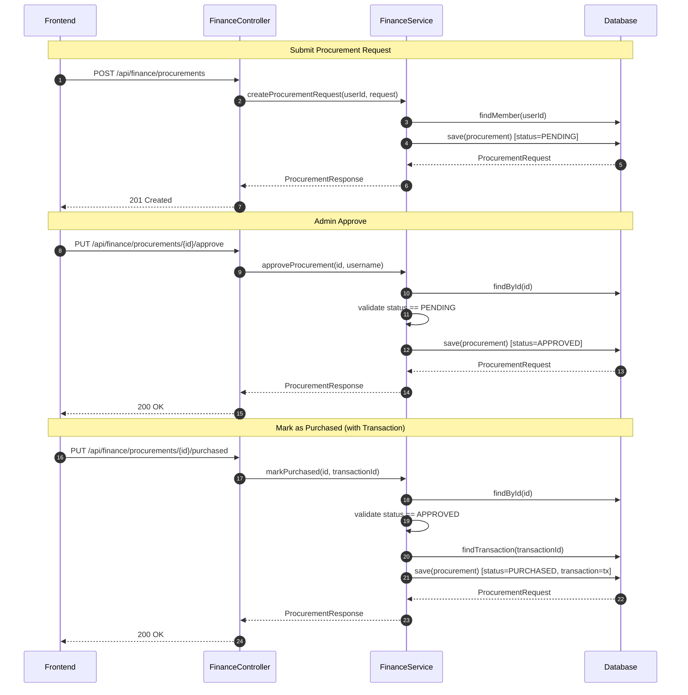

---

## Quick Reference: HTTP Status Codes

| Exception | HTTP Status | When |
|-----------|-------------|------|
| `ResourceNotFoundException` | 404 | Entity not found |
| `BusinessValidationException` | 400 | Invalid business logic |
| `AuthenticationException` | 401 | Login/token invalid |
| `FileStorageException` | 500 | File I/O error |
| `AccessDeniedException` | 403 | No permission |

---

## API Base URL

```
Development: http://localhost:8080/api
Production:  https://lablink.mbclab.com/api
```

---

*Generated: 2026-01-29*
